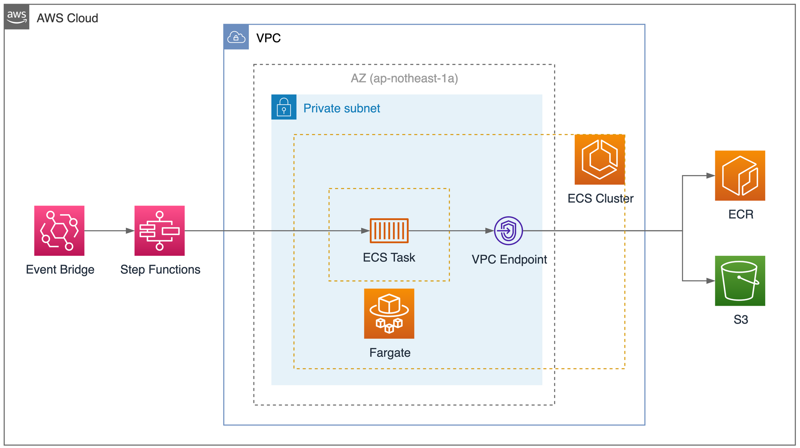
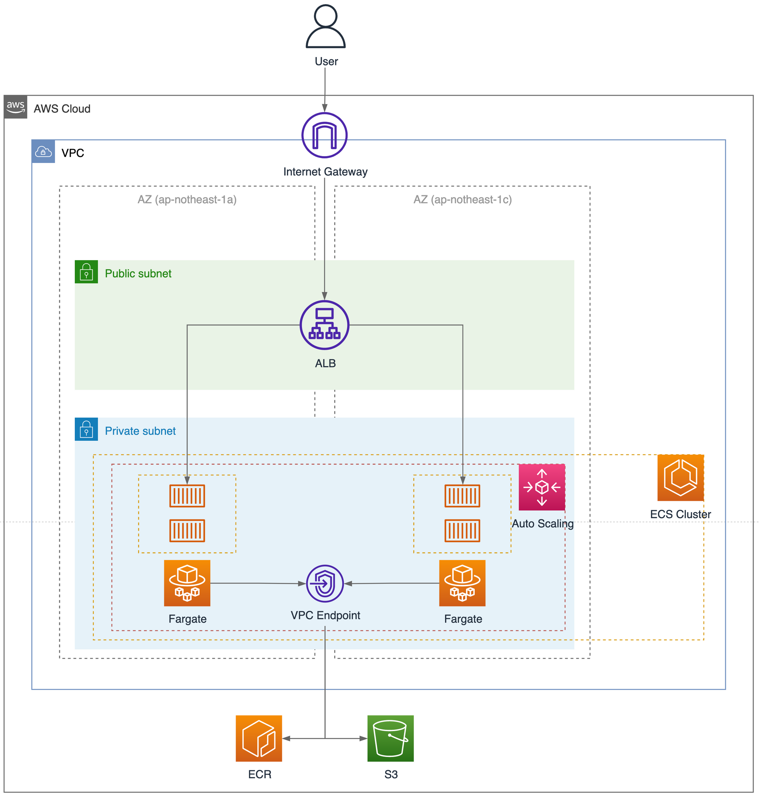

# AWS MLOps Handson
## Architecture
AWS Infra Architecture made by the handson.

### ML Pipeline


### Predict Server


## Requirements
| Software                   | Install (Mac)              |
|----------------------------|----------------------------|
| [pyenv](https://github.com/pyenv/pyenv#installation)             | `brew install pyenv`       |
| [Poetry](https://python-poetry.org/docs/#installation)           | curl -sSL https://install.python-poetry.org &#x7C; python3 - |
| [direnv](https://formulae.brew.sh/formula/direnv)           | `brew install direnv`      |
| [Terraform](https://developer.hashicorp.com/terraform/tutorials/aws-get-started/install-cli#install-terraform)    | `brew install terraform`   |
| [Docker](https://docs.docker.com/desktop/install/mac-install/) | install via dmg |
| [awscli](https://docs.aws.amazon.com/cli/latest/userguide/getting-started-installjkkkkj.html) | `curl "https://awscli.amazonaws.com/AWSCLIV2.pkg" -o "AWSCLIV2.pkg"` |

## Setup
### Install Python Dependencies
Use `pyenv` to install Python 3.9.0 environment
```bash
$ pyenv install 3.9.0
$ pyenv local 3.9.0
```

Use `poetry` to install library dependencies 
```bash
$ poetry install
```

### Configure environment variable
Use `direnv` to configure environment variable
```bash
$ cp .env.example .env
$ direnv allow .
```
Set your environment variable setting
```bash
AWS_REGION=
AWS_ACCOUNT_ID=
AWS_PROFILE=
AWS_BUCKET=
AWS_ALB_DNS=
USER_NAME=
VERSION=2023-05-11
MODEL=sgd_classifier_ctr_model
```

### Create AWS Resources
move current directory to `infra` 
```bash
$ cd infra
```

Use terraform to create aws resources.   
Apply terraform
```bash
$ terraform init
$ terraform apply
```

### Prepare train data
unzip train data
```bash
$ unzip train_data.zip
```

upload train data to S3
```bash
$ aws s3 mv train_data s3://$AWS_BUCKET
```

## Usage
Build ML Pipeline
```bash
$ make build-ml
```

Run ML Pipeline
```bash
$ make run-ml
```

Build Predict API
```bash
$ make build-predictor
```

Run Predict API locally
```bash
$ make up
```

Shutdown Predict API locally
```bash
$ make down
```

Run formatter
```bash
$ make format
```

Run linter 
```bash
$ make lint 
```

Run pytest 
```bash
$ make test 
```
